<p align="center">
  
</p>

<p align="center">
  <a href="https://pypi.org/project/naina/"></a>
  <a href="https://www.npmjs.com/package/@jvoltci/naina"></a>
  <a href="https://github.com/jvoltci/naina/blob/master/LICENSE"></a>
  <a href="https://github.com/jvoltci/naina/actions/workflows/ci.yml"></a>
  <a href="https://github.com/jvoltci/naina/stargazers"></a>
</p>

<h3 align="center">An embeddable document-reading runtime. One C++ core, every language, from a browser tab to a GPU server.</h3>

<p align="center">
  <a href="https://jvoltci.github.io/naina/"><b>🔎 Try in browser</b></a> ·
  <a href="https://jvoltci.github.io/naina/doc/"><b>📚 Documentation</b></a> ·
  <a href="https://pypi.org/project/naina/"><b>📦 PyPI</b></a> ·
  <a href="https://www.npmjs.com/package/@jvoltci/naina"><b>📦 npm</b></a> ·
  <a href="https://github.com/jvoltci/naina/discussions"><b>💬 Discussions</b></a>
</p>

```python
import naina
import numpy as np
from PIL import Image

img = np.asarray(Image.open("invoice.png").convert("RGB"))

# One-liner: image -> markdown
print(naina.read(img))

# Or keep an Engine around
engine = naina.Engine(tier=naina.Tier.SMALL)
page = engine.read(img)
for line in page.lines:
    print(f"{line.confidence:.3f}  {line.text}")
```

## Why

OCR accuracy is a solved commodity. PP-OCRv6's weights are Apache-2.0, so naina
runs the same models PaddleOCR runs and gets the same accuracy. Competing there
is unwinnable and pointless.

The gap is **distribution**. Every existing tool is locked into one lane:

| Tool | Lane | Cannot do |
| --- | --- | --- |
| PaddleOCR | Python, server | No Node/Rust/browser/C ABI. Training framework first, huge surface |
| RapidOCR | Multi-language, as *separate ports* | Behaviour drifts between the Python, C++, Java and .NET versions |
| oar-ocr | Rust only | No Python/Node bindings, no shipped WASM |
| retto | Rust only, det+rec only | No bindings, no layout |
| client-ocr | Browser only | No server, no native |
| ML Kit (Google Lens) | Mobile only, closed weights | Cannot self-host; 5 scripts only |
| MinerU / marker / docling | Python, GPU-leaning | Licence traps, heavy installs |

Nobody ships one engine that runs identically everywhere. This is llama.cpp's
playbook applied to OCR: llama.cpp won on portability and zero dependencies, not
on inference math.

**No OpenCV. No pyclipper. No PaddlePaddle.** The convex hull, minimum-area
rectangle, polygon offset and contour tracing are ~450 lines of tested C++,
because a 300 MB dependency tree would defeat the point of an 11 MB tier.

## What you get

**Three device tiers.** A size axis, not a licence axis — every model naina ships
is Apache-2.0 and safe for commercial use.

| Tier | det | rec | layout | Total | Target | Charset |
| --- | --- | --- | --- | --- | --- | --- |
| `tiny` | 1.8 MB | 4.5 MB | 4.9 MB | **≈ 11 MB** | Browser, phone, Pi Zero | 6,904 (CJK + Latin) |
| `small` | 9.9 MB | 21.2 MB | 23.5 MB | **≈ 55 MB** | Laptop, Pi 5, mobile app | 18,708 (50 languages) |
| `medium` | 62.0 MB | 76.6 MB | 130.5 MB | **≈ 269 MB** | Server, desktop | 18,708 (50 languages) |

PaddleOCR ships no ONNX build of the small layout models, so naina converts them
itself — byte-deterministically, and verified per-column against the Paddle
original. Without that, layout would exist only at the 269 MB tier and an 11 MB
browser build could not describe document structure. See
[`tools/paddle2onnx_layout.py`](tools/paddle2onnx_layout.py).

**Every binding over one C ABI**, so behaviour cannot drift between languages:

| Binding | Status | Install |
| --- | --- | --- |
| C / C++ | ✅ | `naina.h` — the contract every other binding targets |
| Python | ✅ | `pip install naina` |
| Node / TypeScript | ✅ | `npm install @jvoltci/naina` |
| Rust | planned v0.5 | `cargo add naina` |
| WASM / browser | planned v0.4 | `npm install naina-wasm` |

**Weights are mirrored, not borrowed.** naina fetches from
[its own release](https://github.com/jvoltci/naina/releases/tag/models-v1), not
from upstream hosting, so an upstream re-tag or deletion cannot break installs.
Every file is pinned by sha256, so a corrupted or substituted download fails
closed rather than producing silently wrong output. Provenance for each artifact
is recorded in [`NOTICE`](NOTICE) and as a `source_url` in the manifest.

## Benchmarks

Real measurements, not vendor claims.

**End-to-end, `tiny` tier, Apple M3 Pro** — rendered text fixture, 480×140:

| Line | Recognised | Recognition conf | Detection score |
| --- | --- | --- | --- |
| 1 | `HELLO WORLD` | 0.967 | 0.899 |
| 2 | `naina 2026` | 1.000 | 0.925 |

Reproduce: `ctest --preset macos-arm64 -R test_ocr_e2e --output-on-failure`

> **On the accuracy numbers everyone quotes.** Vendors self-report 96.33% on
> OmniDocBench v1.6 while independent evaluation of the same benchmark tops out
> around 90.1%. naina will publish per-device numbers with the harness in-repo
> and the command to reproduce them, or publish nothing. A full benchmark matrix
> lands with v1.0.

## Status

**v0.2 — text spotting works end to end.** The honest state:

| Component | Status |
| --- | --- |
| C ABI (`naina_read`, page accessors, stage-level access) | ✅ |
| Model registry — manifest-driven, sha256-verified, tier fallback | ✅ |
| Detection — PP-OCRv6 det, DBNet decode | ✅ |
| Recognition — PP-OCRv6 rec, CTC greedy decode | ✅ |
| Geometry — convex hull, min-area rect, polygon offset, no OpenCV | ✅ |
| Page storage — pointer-stable, markdown + JSON | ✅ |
| Python binding | ✅ |
| Node binding | ✅ |
| ONNX Runtime backend | ✅ |
| NCNN backend | ⚠️ compiles, but `FindNCNN.cmake` does not locate a brew install |
| Recognition batching (one strip per call today) | ⚠️ correct but unoptimised |
| Layout analysis → structured markdown | ❌ v0.3 |
| WASM + browser app | ❌ v0.4 |
| Rust binding | ❌ v0.5 |
| Cross-binding parity enforced in CI | ❌ v1.0 |
| MCP server (targets the stateless MCP 2026-07-28 spec) | ❌ v1.0 |

13 C++ tests, 6 Python tests, 6 Node tests. CI builds on Linux (gcc + clang) and
macOS arm64.

**Not supported, deliberately:** handwriting (PP-OCRv6 is weak at it and claiming
otherwise would be dishonest), autoregressive VLM parsing, training, and
chart/formula semantic extraction.

## Install

```bash
pip install naina                    # Python
npm install @jvoltci/naina           # Node / TypeScript
```

From source:

```bash
cmake --preset macos-arm64           # or linux-x86_64, linux-arm64, windows-x86_64
cmake --build --preset macos-arm64
ctest --preset macos-arm64
```

Requires CMake ≥ 3.24, a C++20 compiler, `yaml-cpp`, `libcurl`, and ONNX Runtime.

naina ships **no image decoder** on purpose — it takes raw pixels. Use Pillow,
OpenCV, `sharp`, or anything else that hands you a buffer.

## Environment

| Variable | Effect |
| --- | --- |
| `NAINA_CACHE` | Where weights are cached. Default `~/.cache/naina/models` |
| `NAINA_OFFLINE=1` | Disable network; use only what is already cached |
| `NAINA_REGISTRY` | Path to `registry.yaml`. Both bindings set this automatically |

## Documentation

- [**Architecture**](docs/ARCHITECTURE.md) — the C ABI, backends, model registry
- [**Roadmap**](docs/ROADMAP.md) — what ships when
- [**Design spec**](docs/superpowers/specs/2026-07-28-naina-ocr-design.md) — why naina is shaped this way
- [**Contributing**](CONTRIBUTING.md)

## The name

*naina* (नैना) means **eyes** in Hindi. The library reads.

It began as a face-recognition runtime under the same name. That work is
preserved on the [`face-stack`](https://github.com/jvoltci/naina/tree/face-stack)
branch, and the engine it produced — C ABI, backend abstraction, manifest-driven
model loader — is what made this pivot cheap.

## Contributing

PRs welcome. See [CONTRIBUTING.md](CONTRIBUTING.md). Open a Discussion for
anything beyond a small fix.

## License

Apache-2.0. Redistributed model weights are also Apache-2.0 — see [`NOTICE`](NOTICE).
